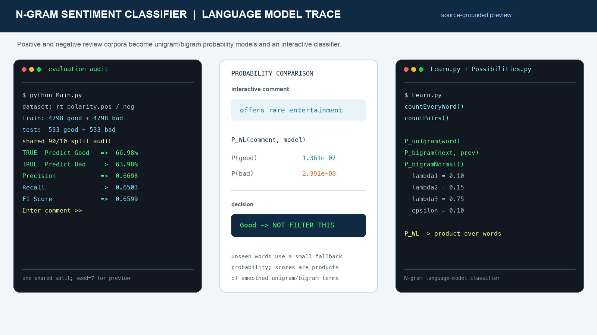
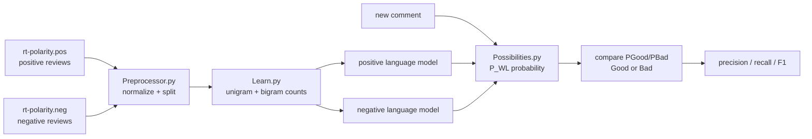

# N-Gram Sentiment Classifier - Interpretable Language Model



Despite the current repository name, the bundled data and implementation are not a spam/ham detector. They are a binary sentiment-classification experiment over positive and negative movie-review sentences stored in `rt-polarity.pos` and `rt-polarity.neg`.

**This is an interpretable NLP/ML text-classification project:** it learns separate positive and negative unigram/bigram language models from labeled text and classifies a new sentence by comparing the two language-model probabilities. The method is classical probabilistic NLP rather than a neural network or embedding-based model, which makes each prediction traceable to word and word-pair counts.

## Recommended project identity

**Recommended repository name:** `ngram-sentiment-classifier`

**GitHub About description:**

> Interpretable Python sentiment classifier using class-specific unigram and interpolated bigram language models with an interactive command-line predictor.

## What the project does

- Loads positive and negative labeled review sentences.
- Applies lightweight punctuation and text normalization.
- Randomly separates each class into a 90% training portion and a 10% test portion.
- Counts individual words with `Learn.countEveryWord()`.
- Counts adjacent word pairs with `Learn.countPairs()`.
- Builds separate positive and negative language models.
- Scores comments with an interpolated bigram probability model.
- Reports precision, recall, F1, and class-level prediction percentages.
- Lets a user enter comments interactively and returns a `Good` or `Bad` decision.
- Includes an optional randomized search for interpolation parameters.

## Method overview



The classifier does not learn a discriminative boundary directly. Instead, it estimates how likely a sentence is under each class-specific language model and chooses the class with the larger probability.

## Probability model

For a comment with tokens `w1 ... wn`, `P_WL()` starts with a unigram probability for the first word and multiplies interpolated bigram probabilities for the remaining words.

The current interpolation is:

```text
P_bigramNormal(next, previous)
    = 0.75 * P_bigram(next | previous)
    + 0.15 * P_unigram(next)
    + 0.10 * epsilon
```

The default values are defined in `Possibilities.py`:

```text
lambda1 = 0.10
lambda2 = 0.15
lambda3 = 0.75
epsilon = 0.10
```

If a word is unseen by a class model, `P_unigram()` returns a small fallback value of `0.01`. If a word pair has no observed count, the interpolated formula still supplies unigram and epsilon contributions. The optional `P_WL_Uni()` function scores a sentence using only unigram probabilities.

## Dataset

The repository includes:

```text
Datasets/rt-polarity.pos  5,331 positive sentences
Datasets/rt-polarity.neg  5,331 negative sentences
```

The examples are short review sentences, not tweets. If the goal is specifically spam detection, the corpus should be replaced with a documented spam/ham dataset and the user-facing labels should be renamed accordingly.

## Source files

```text
.
├── Main.py             # Training, evaluation, interactive prediction
├── Preprocessor.py     # File loading, cleanup, shuffle, 90/10 slices
├── Learn.py            # Unigram and bigram frequency counting
├── Possibilities.py    # Unigram, bigram, interpolation, sentence scoring
├── Datasets/
│   ├── rt-polarity.pos
│   └── rt-polarity.neg
└── docs/
    └── ngram-sentiment-classifier-preview.png
```

## Run locally

The implementation uses only Python’s standard library.

```bash
python3 Main.py
```

The program prints evaluation metrics and then waits for comments. Enter a sentence and press Return:

```text
offers rare entertainment
```

The program prints class probabilities and either:

```text
Good so NOT FILTER THIS
```

or:

```text
Bad so FILTER THIS
```

Enter `!q` to exit.

## Evaluation and reproducibility notes

The code contains a useful evaluation loop, but the current `Main.py` calls `DatasetsPreprocessor()` four separate times when assigning training and test variables. Because each call shuffles independently, the displayed metrics are not generated from one stable shared train/test split. This should be fixed before treating the output as a benchmark.

The preview image uses one shared 90/10 split with a fixed seed for an auditable snapshot. On that split, the current model produced approximately `0.6698` precision, `0.6503` recall, and `0.6599` F1. Results can vary because the source does not currently expose a seed or reusable split function.

## Engineering strengths

The project has a clear separation of responsibilities for a compact NLP system:

- preprocessing is separated from counting;
- unigram/bigram statistics are separated from probability calculations;
- class models are trained independently and compared at prediction time;
- interpolation weights are centralized and can be searched experimentally;
- the command-line loop makes the model easy to inspect interactively.

This structure is a good foundation for turning the experiment into a reusable text-classification package with a formal tokenizer, persistent model artifacts, batch evaluation, and a service/API layer.

## Limitations and next steps

- Replace repeated string `.replace()` calls with a tokenizer that preserves meaningful word boundaries and avoids deleting the substring `ing` from arbitrary words.
- Make preprocessing deterministic and return one shared train/test split.
- Use log probabilities instead of multiplying many small probabilities, which can underflow on longer comments.
- Add Laplace/Kneser-Ney-style smoothing or a documented smoothing strategy for unseen n-grams.
- Add accuracy, confusion matrix, per-class precision/recall, and confidence calibration.
- Optimize parameters against F1 or a chosen validation objective instead of precision alone.
- Avoid mutating module-level interpolation weights during parameter search.
- Add tests for unseen words, unseen bigrams, empty comments, punctuation-only input, and probability ordering.
- Add command-line options for dataset paths, n-gram order, seed, split ratio, and model parameters.
- Save counts and parameters so interactive prediction does not retrain on every launch.
- If spam filtering is the actual goal, use labeled spam/ham data and evaluate on a time-aware or user-aware split to avoid leakage.

## Verification

The Python modules compile successfully with:

```bash
python3 -m py_compile Preprocessor.py Possibilities.py Learn.py Main.py
```

The interactive program was smoke-tested through its evaluation stage. The preview image is generated from the repository’s actual corpus, counting functions, interpolation constants, and probability calculations.
